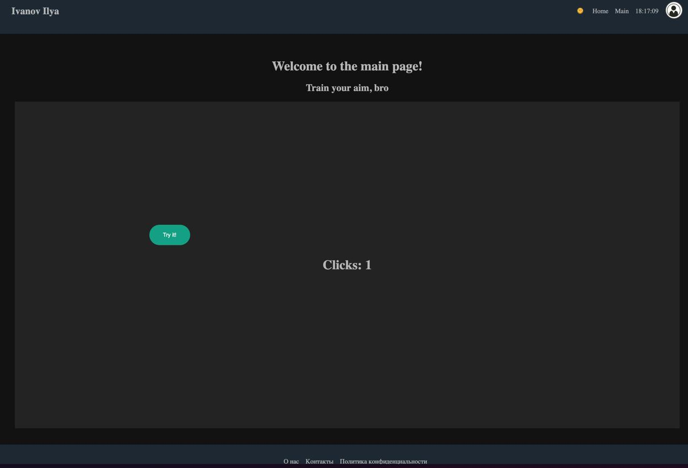
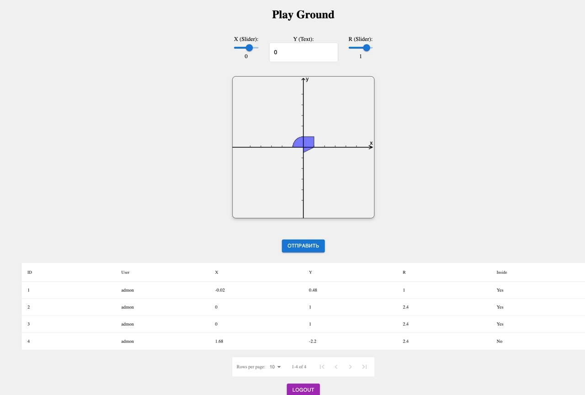
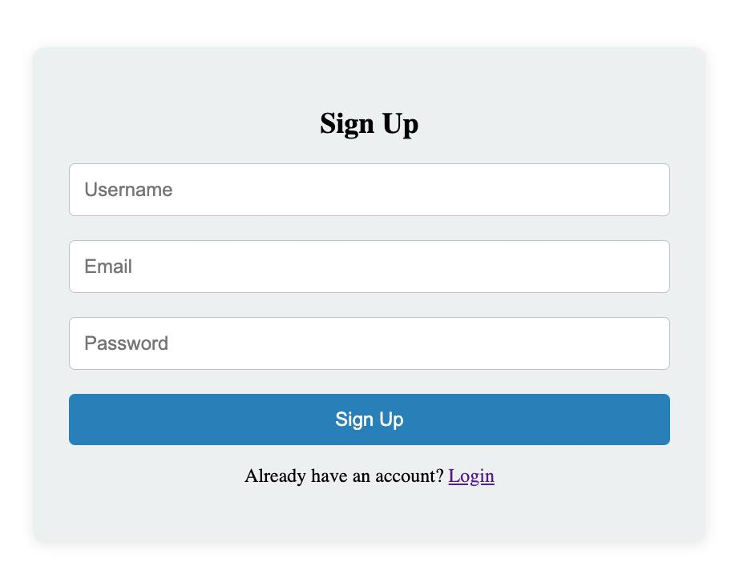

# AreaHitChecker - Веб-приложение для проверки попадания точек в область

## Описание
**AreaHitChecker** - это full-stack веб-приложение для проверки попадания точек в заданную область на координатной плоскости. Проект включает:

- **Бэкенд**: Java EE с EJB, JPA (Hibernate) и REST API
- **Фронтенд**: React + Redux с компонентами PrimeReact
- **Аутентификацию**: Защищенный доступ на основе JWT
- **Базу данных**: PostgreSQL для хранения данных
- **Адаптивный дизайн**: Поддержка десктопов, планшетов и мобильных устройств

## Интерфейс системы

### Страница входа


### Главная страница


### Формы входа, выхода и смены пароля
| Вход                                      | Регистрация                                        | 
|-------------------------------------------|----------------------------------------------------|
|  |  |


## Технологии

### Бэкенд
| Технология    | Назначение |
|---------------|---------|
| Java EE 9     | Фреймворк для enterprise-приложений |
| EJB           | Компоненты бизнес-логики |
| JPA/Hibernate | ORM для работы с БД |
| RESTEasy      | RESTful веб-сервисы |
| PostgreSQL    | Основная база данных |
| JWT           | Аутентификация и авторизация |

### Фронтенд
| Технология | Назначение |
|------------|---------|
| React 18 | Библиотека для интерфейсов |
| Redux Toolkit | Управление состоянием |
| PrimeReact | Библиотека UI-компонентов |
| Axios | HTTP-клиент |
| Vite | Сборка фронтенда |

## Структура проекта

```
lab4_back/
├── front/                   # Фронтенд на React
│   ├── src/
│   │   ├── api/             # API-сервисы
│   │   ├── components/      # React-компоненты
│   │   ├── hook/            # Кастомные хуки
│   │   ├── slice/           # Redux-слайсы
│   │   └── store.js         # Redux-хранилище
├── src/main/java/com/web/lab4_back/
│   ├── controller/          # REST-контроллеры
│   ├── dao/                 # Доступ к данным
│   ├── dto/                 # DTO-объекты
│   ├── entity/              # JPA-сущности
│   ├── exception/           # Кастомные исключения
│   ├── filter/              # HTTP-фильтры
│   ├── service/             # Бизнес-логика
│   └── util/                # Утилиты
├── src/main/resources/      # Конфигурационные файлы
├── pom.xml                  # Maven-конфигурация
└── docker-compose.yml       # Docker-конфигурация
```

## Основные функции

1. **Проверка координат**
    - Графический интерфейс для выбора точек
    - Математическая проверка попадания
    - История результатов

2. **Аутентификация**
    - Безопасный вход/выход на JWT
    - Хеширование паролей
    - Обновление токенов

3. **Адаптивный интерфейс**
    - Поддержка разных устройств
    - Интерактивная координатная плоскость
    - Таблица результатов с фильтрацией

## Запуск проекта

### Требования
- JDK 17+
- Node.js 16+
- Docker 20+
- PostgreSQL 14+

### Установка
1. **Бэкенд**
   ```bash
   cd lab4_back
   mvn clean install
   docker-compose up -d
   ```

2. **Фронтенд**
   ```bash
   cd front
   npm install
   npm run dev
   ```

3. **Доступ**
    - Фронтенд: `http://localhost:5173`
    - Бэкенд: `http://localhost:8080/your-war-name-1.0-SNAPSHOT/api`

## 📝 Лицензия
Проект распространяется под лицензией MIT.